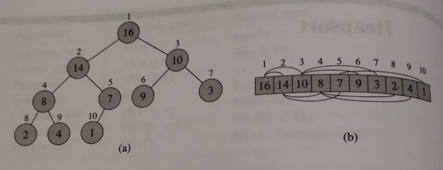

### Heap

##### Heap is a nearly complete binary tree whose node values are obtained from an array.

_fig(a) is the heap formed of elements of the array shown in fig(b)_. Each circle
represents a node and the number within it is the value that this node stores.
The number outside the circle is the corresponding index for this value in the
array in fig(b), assuming that the array is 1-indexed.

### Types of Heaps
There are two types of heaps: max and min. A max heap has the largest node 
(i.e.: node containing the highest value) at its root whereas in a min heap, 
the root contains the lowest value in the entire heap. Beside this, min and max heap satisfy 
a more general heap property. In a max heap, a given node _i_ has a value less
than or equal to the value of its parent _p_. In a min heap, a given node _i_ has
a value greater than or equal to the value of its parent _p_. The figure above 
shows a max heap.

